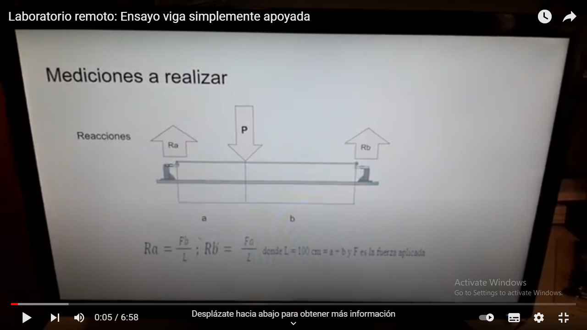

[Proyecto final](doc/LRVSA_proyecto%20final.docx.pdf)

[Comunicacion](doc/Comunicacion-RLVSA.pdf)

[Cliente servidor](doc/LRVSA_cliente_servidor.pdf) 

[Manual usuario](doc/LRVSA_manual_del_usuario.docx.pdf) 

[](https://youtu.be/5dQEUtAvH4g ) 

[Back-end](https://github.com/theinsideshine/beam_remote_lab_server)

[Firmware](https://github.com/theinsideshine/flexion_viga)


# frontend_beam

## Install node.js and npm


## Install vue 
```
npm install vue
```

## https://stackoverflow.com/questions/59867434/every-vue-component-returning-cannot-read-property-parsecomponent-of-undefined
```
npm update vue-template-compiler
```


## Project setup
```
npm install
```

### Compiles and hot-reloads for development
```
npm run serve
```


